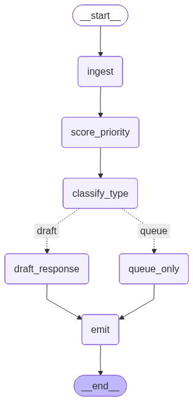

# Hackathon LIA
## Processo 3.1: AGETIC — Triagem Inteligente de Chamados de Suporte de TIC

**Time 2** — Emily Flores · Arthur Schneider · Thiago Poganski · Willian Cintra

---

## Sobre o projeto

A AGETIC (Agência de Tecnologia da Informação e Comunicação) opera a Central de Serviços de TIC da UFMS, atendendo requisições, incidentes e problemas da comunidade universitária. A cada início de turno, o analista de primeiro nível lê manualmente todos os chamados abertos, define prioridade, categoriza e, nos casos mais simples, já redige uma resposta inicial.

Este projeto automatiza esse pipeline com um agente LangGraph, reduzindo o tempo de triagem e liberando os analistas para os atendimentos de maior complexidade.

---

## O que o agente faz

**Priorização** — estima urgência e impacto do chamado e calcula a prioridade resultante por uma matriz determinística (não pelo LLM). A combinação urgência × impacto sempre produz o mesmo resultado, independente do modelo.

**Categorização e escalonamento** — classifica o chamado como Requisição, Incidente ou Problema (framework ITIL), identifica o tipo de serviço conforme o Catálogo TIC oficial da UFMS (Resolução 78/2020) e define a fila de atendimento (N1, N2 ou N3).

**Rascunho de resposta** — para chamados simples (Requisição de baixa ou média prioridade), gera automaticamente um rascunho de e-mail para o usuário, usando exemplos da base de conhecimento como referência de tom e conteúdo. O analista revisa e aprova o rascunho pela interface antes do envio.

**Encerramento** — registra todas as decisões com justificativas textuais, salva o resultado em JSON individual por rota (draft ou queue), CSV consolidado e log estruturado.

---

## Arquitetura

O grafo é construído com `StateGraph` do LangGraph. Cada nó tem responsabilidade única e o estado é imutável entre eles — cada nó retorna apenas os campos que é responsável por preencher.

```
START
  │
  ▼
[ingest]          valida campos obrigatórios e normaliza o texto
  │
  ▼
[score_priority]  LLM estima urgência e impacto
  │               PRIORITY_MATRIX calcula a prioridade (determinístico)
  │               fail-safe: prioridade Crítico se LLM falhar
  ▼
[classify_type]   LLM classifica categoria, tipo de serviço e fila
  │               fail-safe: Incidente/N1 se LLM falhar
  ▼
[route_fn]        Requisição + prioridade Baixo ou Médio  →  draft
  │               qualquer outro caso                     →  queue
  │
  ├── draft ──▶  [draft_response]   gera rascunho com few-shot dinâmico
  │               fail-safe: redireciona para queue se LLM falhar
  │
  └── queue ──▶  [queue_only]       registra na fila humana
                       │
                       ▼
                    [emit]           JSON (por rota) + CSV + log estruturado
                       │
                      END
```



O roteamento entre `draft` e `queue` é determinístico — a regra está no código, não no LLM. O LLM é usado apenas onde há julgamento subjetivo: estimativa de urgência/impacto, classificação do tipo de chamado e geração de texto.

---

## Tecnologias

| Camada | Tecnologia |
|---|---|
| Linguagem | Python 3.11+ |
| Orquestração de agentes | LangGraph |
| Integração com LLM | LangChain OpenAI via OpenRouter |
| Modelo | google/gemma-4-31b-it |
| Estado do grafo | TypedDict com Literal types e Optional |
| Interface | Streamlit |
| Testes | pytest |
| Gestão de dependências | pip + requirements.txt |

---

## Estrutura do projeto

```
hackathon-lia-time2/
├── agent/
│   ├── config.py             # paths e variáveis de ambiente centralizados
│   ├── logger.py             # logging estruturado (console + arquivo)
│   ├── graph.py              # definição do grafo e função de roteamento
│   ├── llm.py                # instâncias singleton do LLM com retry e rastreamento de tokens
│   ├── state.py              # TicketState — estado tipado do grafo
│   ├── nodes/
│   │   ├── ingest.py         # validação e normalização da entrada
│   │   ├── score_priority.py # priorização com PRIORITY_MATRIX + fail-safe
│   │   ├── classify_type.py  # categorização e escalonamento + fail-safe
│   │   ├── draft_response.py # geração de rascunho com few-shot dinâmico + fail-safe
│   │   ├── queue_only.py     # persistência da fila humana
│   │   └── emit.py           # saída JSON (por rota), CSV e log estruturado
│   └── utils/
│       └── few_shot.py       # busca exemplos da knowledge base por tipo de serviço
├── interface/
│   ├── app.py                # ponto de entrada Streamlit — login e navegação
│   └── pages/
│       ├── home.py           # kanban de tickets pendentes e avaliados
│       ├── classificacao.py  # revisão e aprovação de rascunhos (draft)
│       ├── dashboard.py      # métricas, indicadores AGETIC e grafo
│       ├── categorias.py     # análise de distribuição por tipo e categoria
│       ├── detalhes.py       # fluxo completo de entrada e saída por ticket
│       └── relatorio.py      # tabela CSV com filtros
├── prompts/
│   ├── classify_type.md      # prompt com definições ITIL e catálogo TIC oficial
│   ├── score_priority.md     # prompt com critérios de urgência, impacto e regras especiais
│   └── draft_response.md     # prompt com formato de resposta e ANS por serviço
├── data/
│   ├── tickets.json          # 151 tickets sintéticos com gabarito para avaliação
│   └── knowledge_base.json   # 36 exemplos de resposta por tipo de serviço
├── tests/
│   ├── conftest.py           # fixtures compartilhadas
│   ├── test_nodes.py         # testes unitários sem chamada ao LLM
│   └── test_llm_nodes.py     # testes com mock de LLM — caminhos felizes e fail-safes
├── outputs/                  # gerado em runtime — não versionado
│   ├── tickets/
│   │   ├── draft/            # JSONs dos tickets com rascunho gerado
│   │   └── queue/            # JSONs dos tickets escalonados para analista
│   ├── results.csv           # todos os tickets consolidados
│   ├── human_queue.json      # fila de atendimento humano com justificativas
│   ├── approve.json          # rascunhos aprovados pelo analista
│   ├── reject.json           # rascunhos rejeitados pelo analista
│   ├── metrics.json          # métricas e indicadores oficiais AGETIC
│   ├── log.jsonl             # log estruturado por ticket
│   └── agent.log             # log do sistema com timestamps
├── graph.png                 # visualização do grafo LangGraph
├── save_graph.py             # script para gerar graph.png
├── run_stub.py               # execução de demonstração com 3 tickets
├── run_batch.py              # processamento do dataset completo com métricas
├── .env.example              # template de variáveis de ambiente
└── requirements.txt
```

---

## Como rodar

### Pré-requisitos

- Python 3.11 ou superior
- Conta no [OpenRouter](https://openrouter.ai) com créditos disponíveis

### Instalação

```bash
git clone https://github.com/willian-cintra/hackathon-lia-time2.git
cd hackathon-lia-time2

python -m venv .venv

# Windows
.venv\Scripts\activate

# Linux / Mac
source .venv/bin/activate

pip install -r requirements.txt

cp .env.example .env
# Edite o .env e preencha sua OPENROUTER_API_KEY
```

### Executando o agente

```bash
# Demonstração com 3 tickets representativos
python run_stub.py

# Processamento completo do dataset com métricas de acerto
python run_batch.py
```

### Executando a interface

```bash
cd interface
streamlit run app.py
```

**Credenciais de acesso:** `servidor@ufms.br` / `admin123`

A interface abre em `http://localhost:8501` com seis páginas:
- **Home** — kanban de tickets pendentes organizados por prioridade
- **Aprovação da classificação** — revisão e aprovação de rascunhos gerados pelo agente
- **Dashboard Estratégico** — métricas, indicadores oficiais AGETIC e grafo do sistema
- **Análise Geral** — distribuição por categoria, tipo de serviço e nível
- **Detalhamento de Fluxo** — entrada e saída completa por ticket
- **Relatório CSV** — tabela consolidada com filtros

### Executando os testes

```bash
# Testes sem chamada ao LLM
pytest tests/test_nodes.py -v

# Testes com mock de LLM (caminhos felizes e fail-safes)
pytest tests/test_llm_nodes.py -v

# Todos os testes
pytest tests/ -v
```

### Gerando a visualização do grafo

```bash
python save_graph.py
# Gera graph.png na raiz do projeto
```

### Variáveis de ambiente

| Variável | Obrigatória | Padrão | Descrição |
|---|---|---|---|
| `OPENROUTER_API_KEY` | Sim | — | Chave de acesso ao OpenRouter |
| `LLM_MODEL` | Não | `google/gemma-4-31b-it` | Modelo a utilizar |
| `AGETIC_DEBUG` | Não | — | Qualquer valor ativa logs DEBUG |
| `AGETIC_BATCH_SIZE` | Não | `5` | Tickets processados por lote |

---

## Dicionário de dados

### Estado do agente — `TicketState`

| Campo | Tipo | Preenchido por | Descrição |
|---|---|---|---|
| `ticket_id` | `str` | Entrada | Identificador único do chamado |
| `text` | `str` | `ingest` | Texto normalizado do chamado |
| `channel` | `str` | Entrada | Canal de origem: OTRS, Telefone, Balcão, E-mail |
| `requester_profile` | `str` | Entrada | Perfil: aluno, docente\_tec\_administrativo |
| `timestamp` | `str` | Entrada | Data e hora de abertura (ISO 8601) |
| `urgency` | `str` | `score_priority` | Alta, Média ou Baixa |
| `impact` | `str` | `score_priority` | Alto, Médio ou Baixo |
| `priority` | `str` | `score_priority` | Crítico, Alto, Médio ou Baixo (via PRIORITY\_MATRIX) |
| `priority_justification` | `str` | `score_priority` | Justificativa textual da prioridade |
| `category` | `str` | `classify_type` | Requisição, Incidente ou Problema |
| `service_type` | `str` | `classify_type` | Tipo de serviço do Catálogo TIC UFMS |
| `queue` | `str` | `classify_type` | Fila de atendimento: N1, N2 ou N3 |
| `classification_justification` | `str` | `classify_type` | Justificativa textual da classificação |
| `draft_response` | `str` (Optional) | `draft_response` | Rascunho de resposta ao usuário |
| `draft_closure` | `str` (Optional) | `draft_response` | Sugestão de encerramento do chamado |
| `route_decision` | `str` (Optional) | `draft_response` / `queue_only` | draft ou queue |
| `tokens_used` | `int` | Acumulado por nó | Total de tokens LLM consumidos pelo ticket |
| `llm_error` | `str` (Optional) | Fail-safe | Motivo da falha quando fail-safe é ativado |

### JSON individual de ticket — `outputs/tickets/{rota}/{ticket_id}.json`

| Campo | Tipo | Descrição |
|---|---|---|
| `ticket_id` | `str` | Identificador do chamado |
| `text` | `str` | Texto original do chamado |
| `channel` | `str` | Canal de entrada |
| `requester_profile` | `str` | Perfil do solicitante |
| `urgency` | `str` | Urgência estimada pelo LLM |
| `impact` | `str` | Impacto estimado pelo LLM |
| `priority` | `str` | Prioridade calculada pela matriz |
| `category` | `str` | Categoria ITIL |
| `service_type` | `str` | Tipo de serviço |
| `queue` | `str` | Fila de destino |
| `route_decision` | `str` | draft ou queue |
| `priority_justification` | `str` | Justificativa da prioridade |
| `classification_justification` | `str` | Justificativa da classificação |
| `draft_response` | `str` | Rascunho de resposta (vazio se queue) |
| `draft_closure` | `str` | Sugestão de encerramento (vazio se queue) |
| `tokens_used` | `int` | Tokens consumidos pelo processamento |

### Métricas — `outputs/metrics.json`

| Campo | Descrição |
|---|---|
| `execution_id` | Identificador único da execução (timestamp) |
| `total_tickets` | Total de tickets no dataset |
| `processados` | Tickets processados com sucesso |
| `erros` | Tickets com falha de execução |
| `acerto_categoria` | Acurácia da categoria vs gabarito |
| `acerto_prioridade` | Acurácia da prioridade vs gabarito |
| `acerto_rota` | Acurácia da rota vs gabarito |
| `distribuicao_rota` | Contagem de tickets por rota (draft / queue) |
| `tempo_medio_segundos` | Tempo médio de processamento por ticket |
| `tokens` | Consumo detalhado: prompt, completion, total, chamadas |
| `indicadores_agetic.chamados_diarios_encerrados` | % de chamados encerrados automaticamente no dia — Indicador 1 AGETIC |
| `indicadores_agetic.tempo_atendimento_medio` | Tempo médio por chamado em segundos e horas — Indicador 2 AGETIC |
| `indicadores_agetic.taxa_automacao` | % de chamados resolvidos sem intervenção humana |

---

## Resultados

Avaliado sobre 151 tickets sintéticos gerados a partir do processo oficial da AGETIC, com gabarito verificado matematicamente pela PRIORITY_MATRIX e pela lógica do `route_fn`.

| Dimensão | Acerto |
|---|---|
| Categoria (Requisição / Incidente / Problema) | 94.0% |
| Prioridade (Crítico / Alto / Médio / Baixo) | 74.8% |
| Rota (draft / fila humana) | 84.8% |
| Erros de execução | 0 / 151 |
| Tickets resolvidos automaticamente | 57 / 151 (37.7%) |
| Tempo médio por ticket | 13.9s |
| Tokens médios por ticket | 3.057 |

Toda decisão vem acompanhada de justificativa textual — nenhuma saída do agente é caixa-preta.

---

## Decisões de design relevantes

**Prioridade calculada por matriz, não pelo LLM.** O modelo estima urgência e impacto separadamente; a combinação é calculada por uma tabela fixa no código. Isso garante que a mesma urgência e o mesmo impacto produzam sempre a mesma prioridade, independente do modelo ou da temperatura.

**Fail-safe em todos os nós LLM.** Quando qualquer chamada ao LLM falha — por timeout, JSON inválido, campos ausentes ou valores inesperados — o nó não propaga o erro. Em vez disso, aplica valores conservadores e registra o motivo em `llm_error` no estado. Para `score_priority`, aplica prioridade Crítico. Para `classify_type`, aplica categoria Incidente. Para `draft_response`, redireciona o ticket para a fila humana. Em todos os casos, o ticket é processado e nenhum dado é perdido.

**JSONs separados por rota.** Tickets com rascunho gerado são salvos em `outputs/tickets/draft/` e ficam disponíveis para revisão na interface. Tickets escalonados para analista humano são salvos em `outputs/tickets/queue/`. Essa separação torna o fluxo de aprovação direto — a interface lê apenas a pasta `draft/`.

**Rascunho editável antes da aprovação.** A interface permite que o analista edite o `draft_response` gerado pelo agente antes de aprovar. O texto editado é o que vai para `approve.json` — não o original do LLM.

**Few-shot dinâmico na geração de rascunhos.** Antes de gerar o rascunho, o sistema busca na knowledge base os exemplos mais relevantes para o tipo de serviço do chamado. Se não encontrar exemplos do tipo específico, retorna sem exemplos em vez de usar exemplos de serviços não relacionados.

**Roteamento determinístico.** A decisão entre gerar rascunho ou encaminhar para analista humano é uma regra de código, não uma decisão do LLM. Qualquer Incidente ou Problema vai para a fila humana. Requisições de alta prioridade também. Apenas Requisições de prioridade Baixo ou Médio recebem rascunho automático.

**Configuração centralizada.** Todos os paths de arquivo e variáveis de ambiente estão em `agent/config.py`. Nenhum outro módulo usa strings hardcoded ou acessa `os.environ` diretamente — qualquer mudança de path ou configuração é feita em um único lugar.

**Logging estruturado.** Todos os módulos usam o sistema de logging centralizado em `agent/logger.py`. Mensagens são gravadas simultaneamente no console e em `outputs/agent.log` com timestamp, nível e módulo de origem. O modo debug é ativado por variável de ambiente sem alterar código.

**Indicadores oficiais AGETIC.** O `run_batch.py` calcula e persiste os indicadores oficiais definidos pela SECLI/DINTEC/AGETIC: Chamados Diários Encerrados e Tempo de Atendimento Médio, além da Taxa de Automação. Esses indicadores são exibidos no Dashboard da interface.